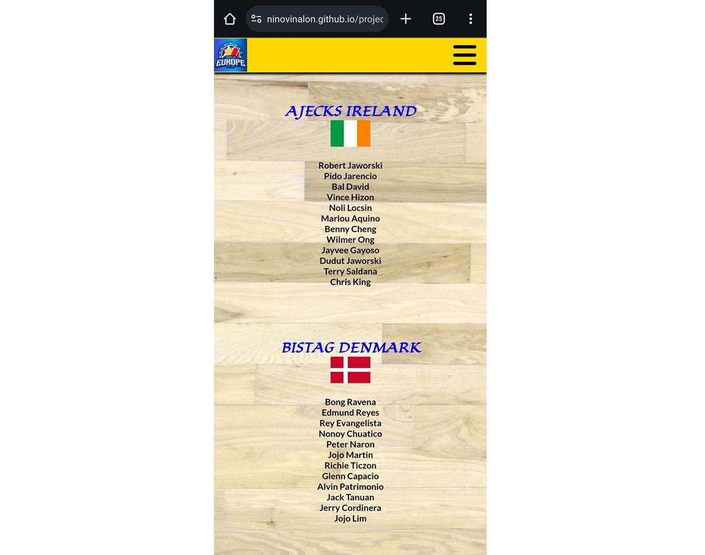
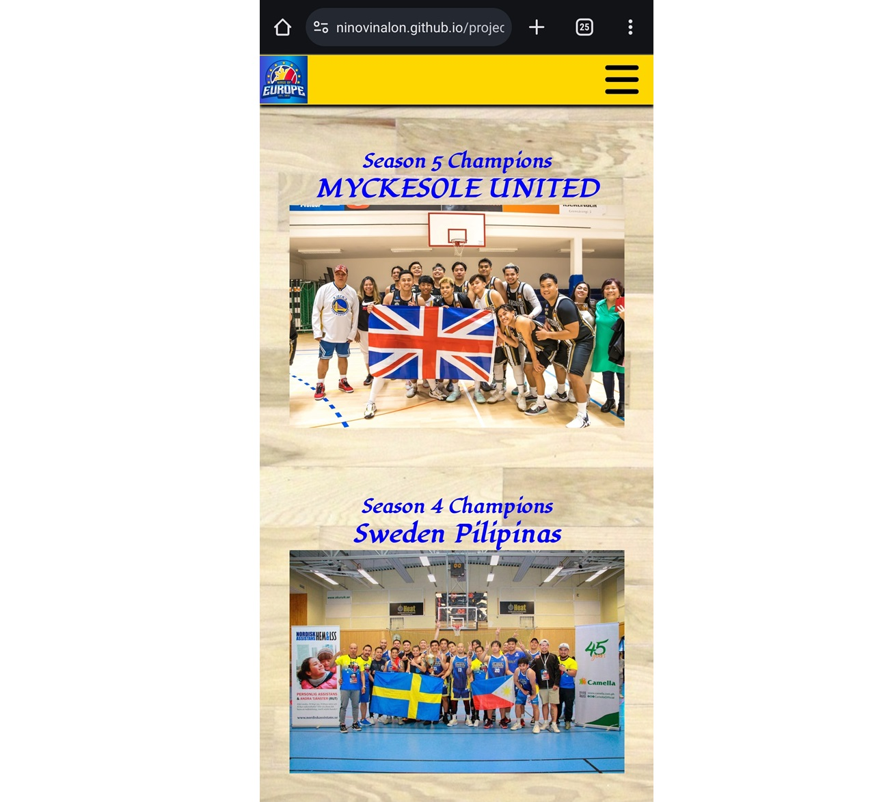
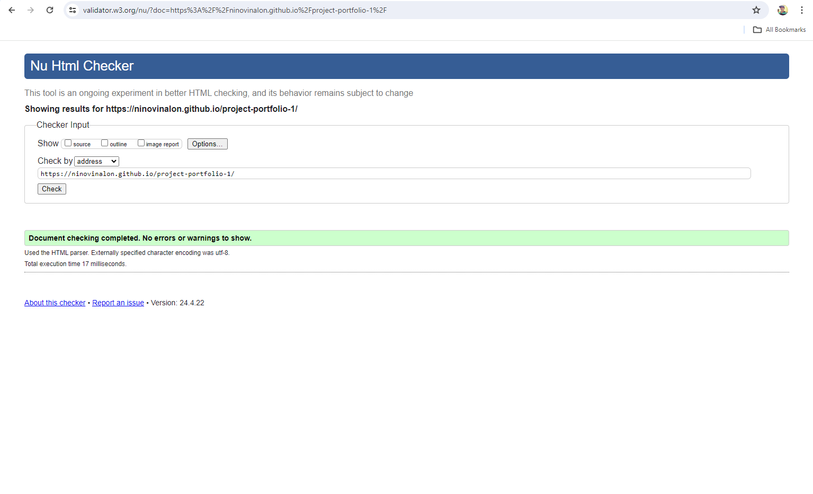
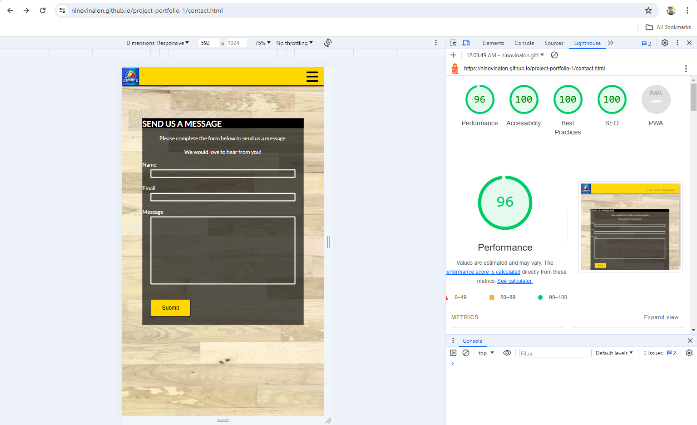

# Kings of Europe
Visit the website [here.](https://ninovinalon.github.io/project-portfolio-1/index.html)

The Kings of Europe website is all about the biggest Filipino basketball league that will happen here in Europe, and it will happen this year in Ireland.

## User Experience
### Target Audience
This website is intended for Filipinos who have a love for basketball.

### User Expectation
- Easy to use on all screen sizes with a responsive design.
- Simple design to keep up with the event and league news.  
- A live update on the games that are taking place.
- Any player movement will be reported on the news.
- Sending messages on the Send Us page is a breeze.

### User Stories

1. As a basketball player, I am interested in watching what is happening in the league
2. As a basketball player, I am also curious about who will represent each country in Europe.
3. As a basketball player, I'm also curious if these players can also play in the professional league.
4. As a basketball player, I am curious about the winners from the past seasons.

## Design

### Wireframes

HTML was used to create the wireframes for this website. The website is made up of four pages: the Home page, Teams page, Champions page, and Send us page.

**1. HOMEPAGE **

**2. TEAMS PAGE **

**3. CHAMPIONS PAGE **

**4. SEND US PAGE **

### Color Scheme

The color scheme for this website is simple. I have chosen gold for the background of the header and footer with black and  white text throughout, with blue buttons.

### Typography

The fonts I have used on this website are simple sans serif and Lugrasimo from Google Fonts throughout its content.

## Features

### Search Engine Optimization

Meta tags with descriptions and keywords have been added to each page's head in order to enhance website optimization, ranking, quality, and quantity.

### Homepage

The homepage for the website displays a simple design featuring the basketball league, Kings of Ireland, followed by the teams involved and the overall mechanics of the game. 

There are also clickable buttons that direct users to the league's social media pages placed at the bottom of the page.

At the top right corner of the homepage, there is a dropdown button on which you can select which page to go to.

**1. Homepage on desktop**

**2. Homepage on mobile**

### Teams Page

The template design for the second page was identical to that of the homepage. This page displays all the teams and players who will play in the league.

**1. Teams page on desktop**

**2. Teams page on mobile**

### Champions Page

Following the same template design as the homepage, this features all teams who have won championship games for the last 5 seasons.

**1. Champions page on desktop**

**2. Champions page on mobile**

### Send Us Page

**1. Send us page on desktop**

**2. Send us page on mobile**

### Future Development

In future developments, I would like to add more details to the games, such as videos and game replays. I would also like to improve user interactions by adding an announcement/news update on the page.

### Technologies Used

**Github** - is used for version control, site storage, and deployment of my project.

**Gitpod** - is the one I used to write, edit, commit and push my code to Github.

**Python** - is used to open a local HTTP server when coding in Gitpod to preview my site.

**HTML 5** - is utilized to construct the basic components of my website.

**CSS** - is used to style all elements on my website.

**DevTools** - is employed to test my website's responsiveness and detect any bugs.

**Google Fonts** - is used to import the font Lugrasimo used on my site.\

**Font Awesome** - is used to import icons to all web pages.

**Favicon.io** - is used to create a favicon for my website.

**W3C Markup** - Validation Service is used to validate HTML code.

**W3C CSS Validation Service** - is used to validate CSS code.\

**Lighthouse** - used to generate Lighthouse reports.

### Language Used

HTML 5 and CSS

### Libraries and programmes used

Github was used for version control, site storage, and to deploy my project to Github pages.
Gitpod is the IDE I used to write, edit, commit, and push my code to Github.

## Deployment

I have deployed my website on Github pages.

## Local Deployment

#### How to Clone

1. Log into your GitHub account.
2. Go to the repository of this project: <https://github.com/NinoVinalon/project-portfolio-1>.
3. Click on the code button, and copy your preferred clone link.
4. In your code editor, open the terminal and change the current working directory to the location where you want the cloned directory to be stored.
5. Type 'git clone' into the terminal, paste the link you copied in step 3 and press enter.

#### How to Fork

1. Sign up or log in to Github.
2. Go to the repository of this project: <https://github.com/NinoVinalon/project-portfolio-1>.
3. Click the Fork button in the top right corner.

## Testing

1. The WC3 Validator was used to check all pages of my website for HTML 5 code, and there were no errors found. 

2. Jigsaw CSS Validator was used to validate the CSS code written for my website. No errors were found.

3. Lighthouse testing - I used Google Chrome's Lighthouse Developer Tool to gain insight into the performance and accessibility metrics of my website.

**Index Page**

**Team Page**

**Champions Page**

**Send Us Page**

### Device Testing

**The website was tested on the following devices:**

- Samsung Galaxy S23 Ultra
- Iphone 13 Pro Max
- Apple Ipod 10th Gen
- Microsoft Surface
- Acer Predator Triton 300

**The website was tested on the following browsers:**

- Google Chrome
- Safari

### Accessibility

In order to simplify site navigation, I have employed aria-labels, alt tags, and semantic elements. I added a background photo showing the basketball court flooring, which makes it more beautiful. Text colors are typically black and white. The choice buttons are blue in comparison to the gold background of the header and footer of the website to show a clear difference between the two areas.

### Bugs

The only bug that I encountered in this program is when the images are not responsive. So what I did was change the height and width values from pixels to percentages.

## Credits

### Content and Images

I want to express my gratitude to the organizers of the Kings of Europe league for allowing me to use their league as the subject of my project. They provide me with the content I require, which includes images, players, teams, and all the photos I used.

### Icons

Favicon and Fontawesome were used to generate the icons.

### Bugs and Errors

I want to express my gratitude to my mentor, Harry Dhillon, for his assistance with the project and Ms. Amy Richardson for her consistent response every time I send her a message about my project. I am grateful to the Tutor Support who assisted me with the errors I encountered while finishing my project.

